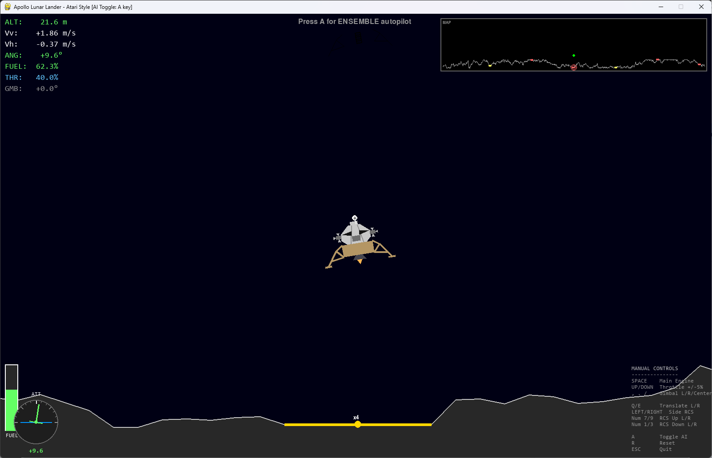
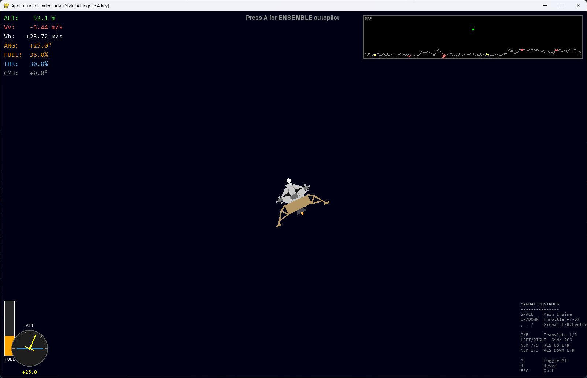
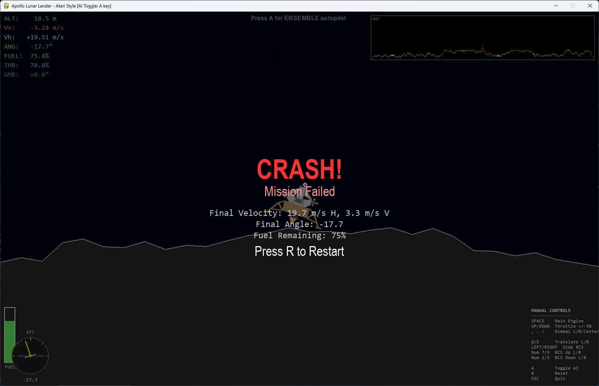

# Apollo Lunar Lander AI

A reinforcement learning system that trains Double DQN agents to land an Apollo-style lunar module on target landing pads. Agents are trained using a 3-stage curriculum with spring-based potential reward shaping, then deployed in a playable pygame game as either a single AI autopilot or a **triple ensemble with majority voting**.

https://github.com/lenger06/lunar-lander-ai/raw/main/screenshots/Landings.mp4

<p align="center">
  
  
</p>
<p align="center">
  <em>Left: AI ensemble autopilot (seeds 456, 123, 1111) with vote indicator &nbsp;|&nbsp; Right: Manual control mode</em>
</p>

<p align="center">
  
  
</p>
<p align="center">
  <em>Left: Manual descent at altitude &nbsp;|&nbsp; Right: The inevitable outcome of manual control</em>
</p>

## Architecture

### Double DQN Agent

Each agent is a **Double Deep Q-Network (Double DQN)** with experience replay:

- Network: 9-dim input → 256 → 256 → 128 → N actions
- Soft target network updates (tau=1e-3), gradient clipping at 1.0
- Epsilon-greedy exploration with per-stage decay schedules

Multiple agents are trained independently with different random seeds, then the best 3 are combined into an ensemble for inference.

### Triple Ensemble Voting

The ensemble system loads 3 independently trained agents and selects actions via majority vote:

- **Unanimous (3/3):** All 3 agents agree → use that action
- **Majority (2/3):** 2 agents agree → use the majority action
- **Split (1/3):** All 3 disagree → the **master agent** (first seed specified) decides

The first model specified on the command line is the master/tie-breaker. This provides NASA-style triple redundancy — the system is robust against any single agent making a bad decision.

### State Space (9 dimensions)

| Index | Feature | Normalization |
|-------|---------|---------------|
| 0 | X position relative to target pad | / (world_width / 2) |
| 1 | Y position relative to target pad | / 50.0 |
| 2 | X velocity | / 10.0 |
| 3 | Y velocity | / 10.0 |
| 4 | Angle (continuous, normalized) | atan2(sin, cos) |
| 5 | Angular velocity (negated) | clipped to [-5, 5] |
| 6 | Left leg contact | binary (0 or 1) |
| 7 | Right leg contact | binary (0 or 1) |
| 8 | Throttle level | 0.1 to 1.0 |

### Action Space

| Action | ID | Available |
|--------|----|-----------|
| NOOP | 0 | All stages |
| RCS Rotate Left | 1 | All stages |
| Throttle Up (+5%) | 2 | All stages |
| Throttle Down (-5%) | 3 | All stages |
| RCS Rotate Right | 4 | All stages |
| Translate Left | 5 | Stages 2-3 (7-action) |
| Translate Right | 6 | Stages 2-3 (7-action) |

The main engine fires continuously at the current throttle level every step. Actions adjust throttle or fire RCS thrusters. Both AI and manual control use identical physics (15x boosted RCS thrust for meaningful control authority).

### Physics

Uses Box2D with game-identical solver settings (10 velocity iterations, 10 position iterations, 1/60s timestep). The training environment (`CurriculumGameEnv`) runs the same physics as the actual game, ensuring trained behavior transfers directly.

## Physics Accuracy: Game vs Real Apollo

The game physics are modeled on the real Apollo Lunar Module and Moon. Most parameters are taken directly from NASA specifications for the Apollo 11 mission.

### Moon

| Parameter | Game | Real Moon | Accuracy |
|-----------|------|-----------|----------|
| Surface gravity | 1.62 m/s² | 1.62 m/s² | Exact |
| Atmosphere/damping | 0.0 (vacuum) | 0.0 (vacuum) | Exact |
| Diameter | 3,475 km | 3,474 km | Exact |
| Low orbit altitude | 100 km | 110 km (60 nmi) | Close |

### Lunar Module Mass

| Parameter | Game | Real (Apollo 11) | Accuracy |
|-----------|------|-------------------|----------|
| Descent stage dry mass | 2,034 kg | 2,034 kg | Exact |
| Descent fuel capacity | 8,200 kg | 8,248 kg | ~99% |
| Descent stage total | 10,234 kg | 10,282 kg | ~99% |
| Ascent stage dry mass | 2,445 kg | 2,445 kg | Exact |
| Ascent fuel capacity | 2,353 kg | 2,376 kg | ~99% |
| Ascent stage total | 4,798 kg | 4,821 kg | ~99% |
| **Full LM total** | **15,032 kg** | **15,103 kg** | **~99%** |

### Engines

| Parameter | Game | Real LM | Accuracy |
|-----------|------|---------|----------|
| DPS max thrust | 45,040 N | 45,040 N (10,125 lbf) | Exact |
| DPS throttle range | 10% – 100% | ~10% – 100% | Exact |
| DPS gimbal range | ±6° | ±6° | Exact |
| DPS specific impulse | ~311 s | 299–305 s | ~2% high |
| DPS fuel consumption | 14.77 kg/s | ~15.06 kg/s | ~98% |
| APS thrust | 15,600 N | 15,600 N (3,500 lbf) | Exact |
| APS type | Fixed thrust | Fixed, non-gimbaled | Match |
| APS fuel consumption | 5.12 kg/s | ~5.2 kg/s | ~98% |

The real DPS had a restricted throttle band (65%–92.5% avoided due to nozzle erosion). The game does not model this restriction.

### Reaction Control System (RCS)

| Parameter | Game | Real LM | Notes |
|-----------|------|---------|-------|
| Thrust per thruster | 445 N | 445 N (100 lbf) | Exact base value |
| Configuration | 4 pods × 4 thrusters | 4 pods × 4 thrusters | Exact |
| **Game boost** | **15×** | 1× | Gameplay scaling |
| Effective per-thruster | 6,675 N | 445 N | 15× stronger |

The 15× RCS boost is the largest deliberate deviation from reality. At real thrust levels, RCS provides very gentle rotational authority — appropriate for the real LM's slow orbital descent over many minutes, but too sluggish for a game where responsive control is needed in a short time window.

### Dimensions

| Parameter | Game | Real LM | Accuracy |
|-----------|------|---------|----------|
| Descent stage width | 4.2 m | 4.2 m | Exact |
| Descent stage height | 1.6 m | 1.7 m | ~94% |
| Landing leg span | ~7.6 m | 9.4 m (diagonal) | ~81% |
| Foot pad width | 0.9 m | ~0.9 m | Match |
| Foot pad friction | 1.4 | N/A (lunar regolith) | Tuned for gameplay |

### Thrust-to-Weight Ratio

| Condition | Game | Real LM |
|-----------|------|---------|
| Full fuel (start of descent) | 2.71 | 1.84 |
| Near empty (landing) | ~2.71 | ~3.66 |

The game uses a constant TWR of 2.71 (`thrust_factor = gravity × 2.71`). The real LM's TWR changed dramatically as fuel burned off — starting around 1.84 at the beginning of powered descent and climbing to ~3.66 near touchdown. The game's value sits in the middle. The real LM started powered descent from 15 km altitude at orbital velocity, burning most of its fuel for deceleration. The game starts at ~50–100 m altitude, so the higher constant TWR provides appropriate control authority for the shorter hover-and-land scenario.

### Gameplay Fuel Budget

The game descent fuel is scaled down to ~82 kg (vs 8,248 kg real) because the game simulates only the final landing phase, not the full 12-minute powered descent from orbit. Fuel consumption rates use the real formula (`thrust / (Isp × g₀)`) with the reduced budget.

### Summary

| Category | Accuracy |
|----------|----------|
| Moon gravity | Exact |
| Lander masses | >99% (Apollo 11 values) |
| Engine thrust values | Exact (DPS + APS) |
| Throttle range & gimbal | Exact (±6°, 10–100%) |
| Fuel consumption rates | ~98% |
| Descent stage dimensions | Exact (4.2 m width) |
| RCS base thrust | Exact (445 N), then 15× boosted |
| TWR profile | Constant 2.71 vs variable 1.84–3.66 |
| Ascent stage dimensions | ~50% scale (visual choice) |
| Gameplay fuel budget | ~1% of real (appropriate for scenario) |

### Controls Comparison

The real Apollo LM was controlled by two hand controllers, a guidance computer (LGC), and associated mode switches. The game simplifies this into discrete key presses (manual) or single-action-per-frame decisions (AI).

#### Attitude Control (Rotation)

| | Game — Manual | Game — AI | Real Apollo LM |
|-|---------------|-----------|----------------|
| **Input device** | Numpad 7/Home, Numpad 9/PgUp | Actions 1 and 4 | ACA (Attitude Controller Assembly) — 3-axis proportional joystick |
| **Input type** | Discrete key press | One action per frame (60 Hz) | Proportional — ±10° deflection with 1° deadband |
| **Thruster firing** | Coupled pair: left pod + right pod fire in opposing vertical directions | Same coupled pair logic | 16 RCS jets (4 pods × 4 jets), jet-select logic computed by LGC or ATCA |
| **Control modes** | Direct thruster firing only | Direct thruster firing only | Rate Command/Attitude Hold (ACA displacement = rate; release = hold), Pulse Mode (minimum impulse per deflection), or full Auto (LGC controls) |
| **Attitude hold** | No — rotation continues until countered | No — agent must learn to counter | Yes — LGC/ATCA automatically holds attitude when ACA is in detent |

#### Translation (Lateral Movement)

| | Game — Manual | Game — AI | Real Apollo LM |
|-|---------------|-----------|----------------|
| **Input device** | Numpad 4/Left, Numpad 6/Right | Actions 5 and 6 (7-action models) | TTCA (Thrust/Translation Controller Assembly) — 3-axis T-handle |
| **Axes** | Lateral only (left/right) | Lateral only (left/right) | All 3 axes (X, Y, Z translation) |
| **Thruster firing** | Side thrusters on one pod | Both pods fire in same direction | RCS jets selected by LGC/ATCA for requested translation axis |
| **Available** | Always | Only in 7-action models (Stages 2–3) | Always (TTCA jets position) |

#### Throttle (Descent Engine)

| | Game — Manual | Game — AI | Real Apollo LM |
|-|---------------|-----------|----------------|
| **Input device** | Up/Down arrow keys | Actions 2 and 3 | TTCA X-axis (throttle position) |
| **Input type** | Discrete 5% steps | Discrete 5% steps | Continuous — proportional to handle deflection |
| **Range** | 10% – 100% | 10% – 100% | 10% – 92.5% (with restricted band at 65%–92.5%) |
| **Soft stop** | No | No | Yes — at ~53% deflection for fine control during landing |
| **Auto mode** | No | No | Yes — LGC commands throttle in AUTO mode; manual input can be summed with or override LGC commands |
| **Engine state** | Always on | Always on | Start/stop via ENGINE START/STOP buttons |

#### Gimbal (Engine Thrust Vectoring)

| | Game — Manual | Game — AI | Real Apollo LM |
|-|---------------|-----------|----------------|
| **Control** | Manual — Comma/Period/Slash keys | Not available (fixed at 0°) | Automatic — LGC trims gimbal to keep thrust through CG |
| **Range** | ±6° | N/A | ±6° in pitch and roll |
| **Rate** | 1° per key press | N/A | Continuous servo-driven |
| **Purpose** | Pilot-controlled thrust vectoring | N/A | CG offset compensation (automatic trim) |

#### Guidance Computer

| | Game — Manual | Game — AI | Real Apollo LM |
|-|---------------|-----------|----------------|
| **Computer** | None | Double DQN neural network | Apollo Guidance Computer (AGC/LGC) with DSKY interface |
| **Backup** | N/A | Triple ensemble voting | AGS (Abort Guidance System) — independent backup computer |
| **Programs** | N/A | Single trained policy | P63 (braking), P64 (approach), P66 (landing phase) |
| **Landing point redesignation** | Tab/Shift-Tab to cycle pads | Target pad fixed per episode | LPD mode — astronaut nudges landing site via ACA inputs to LGC |

#### Key Differences Summary

| Feature | Game — Manual | Game — AI | Real Apollo LM |
|---------|---------------|-----------|----------------|
| Attitude hold | No | No | Yes (automatic) |
| Proportional inputs | No (discrete) | No (discrete) | Yes (continuous joystick) |
| Engine start/stop | Always on | Always on | Pilot-controlled |
| Gimbal control | Manual | None | Automatic (LGC) |
| Throttle auto mode | No | No | Yes (LGC P66) |
| 3-axis translation | Lateral only | Lateral only | Full 3-axis |
| RCS thrust | 15× boosted | 15× boosted | Real (445 N/jet) |
| Control update rate | 60 Hz (every frame) | 60 Hz (every frame) | 25.6 Hz (AGC cycle) |

## Training

### 3-Stage Curriculum

Training proceeds through 3 stages, each building on the previous stage's learned weights:

#### Stage 1: Stabilize + Hover (5 actions)

**Goal:** Learn to stay upright and maintain altitude using rotation RCS and throttle only.

| Parameter | Value |
|-----------|-------|
| Actions | 5 (no lateral translation) |
| k_rotation | 25.0 |
| c_angular | 40.0 |
| c_descent | 2.0 |
| c_ascend | 4.0 |
| Max steps | 1500 |
| Graduation | 95% success, min 200 episodes |
| Learning rate | 5e-4 |
| Epsilon | 1.0 → 0.05 (decay 0.997) |

**Success criteria:** Angle < 0.35 rad, angular velocity < 0.5 rad/s, vertical velocity < 3.0 m/s.

#### Stage 2: Approach Pad (7 actions)

**Goal:** Navigate horizontally toward the target pad while descending. Introduces lateral RCS translation.

| Parameter | Value |
|-----------|-------|
| Actions | 7 (adds Translate L/R) |
| k_rotation | 20.0 |
| k_horizontal | 3.0 |
| k_vertical | 1.2 (quadratic mode) |
| c_angular | 30.0 |
| c_descent | 3.0 |
| c_ascend | 5.0 |
| proximity_gain | 5.0 |
| Max steps | 2000 |
| Graduation | 70% success, min 1000 episodes |
| Learning rate | 3e-4 |
| Epsilon | 0.3 → 0.02 (decay 0.998) |

**Success criteria:** Angle < 0.26 rad, vertical velocity < 2.0 m/s, horizontal distance to pad < 15m, angular velocity < 0.3 rad/s, altitude < 20m. Loads Stage 1 best weights with action space expanded from 5 to 7.

#### Stage 3: Precision Landing (7 actions)

**Goal:** Actually touch down on the pad. Uses logarithmic vertical spring so reward increases near the surface, encouraging commitment to landing.

| Parameter | Value |
|-----------|-------|
| Actions | 7 |
| k_rotation | 20.0 |
| k_horizontal | 3.0 |
| k_vertical | 2.0 (log mode) |
| vertical_log_scale | 50.0 |
| c_descent | 5.0 |
| c_ascend | 5.0 |
| time_penalty | 0.3 |
| Max steps | 3000 |
| Graduation | 50% success, min 1500 episodes |
| Learning rate | 1e-4 |
| Epsilon | 0.15 → 0.01 (decay 0.999) |

**Success criteria:** Physical touchdown detected (legs contact terrain with speed < 3 m/s and angle < 30 degrees). Loads Stage 2 best weights.

### Training Commands

Train the full 3-stage curriculum for a seed:

```bash
python train_in_game.py --seed 456 --episodes 5000
```

Train only a specific stage (e.g., retrain Stage 3 with existing Stage 2 weights):

```bash
python train_in_game.py --seed 456 --stage 3 --episodes 5000 --single-stage
```

Watch training live with visualization:

```bash
python train_in_game.py --seed 456 --episodes 5000 --visualize
```

**Options:**

| Flag | Description |
|------|-------------|
| `--seed N` | Random seed (default: 42) |
| `--stage N` | Start from stage N (1-3, default: 1) |
| `--episodes N` | Max episodes per stage (default: 5000) |
| `--single-stage` | Only train the specified stage |
| `--visualize` | Render training live (slower) |
| `--save-dir DIR` | Model save directory (default: models/) |

**Output files** (saved to `models/`):
- `lateral_stage{1,2,3}_seed{N}_best.pth` — Best model per stage
- `lateral_stage{1,2,3}_seed{N}_final.pth` — Final model per stage
- `lateral_summary_seed{N}.json` — Training summary with metrics

### Reward System

Rewards use **potential-based reward shaping**: `reward = -(E_new - E_old)`. Reducing total spring energy is rewarded; increasing it is penalized. This guarantees the optimal policy is preserved while providing dense learning signals.

#### Springs (Position-Based)

**A - Rotation Spring:** 3 virtual springs on an imaginary circle penalize deviation from upright. A rotation deadzone (10 degrees) allows small tilts without penalty.

**B - Horizontal Spring:** `E = 0.5 * k_horizontal * dx^2` where `dx` is distance from pad center. Pulls the lander toward the target pad.

**C - Vertical Spring** (two modes):

- **Quadratic (Stages 1-2):** `E = 0.5 * k_eff * h^2`. Gradient `dE/dh = k*h` is proportional to altitude, so reward per meter *decreases* near the surface. The `proximity_gain` parameter increases the effective spring constant at low altitude to partially compensate.

- **Logarithmic (Stage 3):** `E = k * scale * log(1 + h)`. Gradient `dE/dh = k*scale/(1+h)` is inversely proportional to altitude, so reward per meter *increases* near the surface. This creates a "commitment reward" that incentivizes the agent to push through the final meters to touchdown rather than hovering.

#### Dampers (Velocity-Based)

**D - Angular Velocity:** `E = c_angular * omega^2`. Penalizes rotational speed.

**E - Descent Profile:** Tracks a target descent rate that scales linearly with altitude: `target = descent_max_rate * (altitude / spawn_altitude)`. At 50m altitude the target is -2.5 m/s; at 5m it's -0.25 m/s. Penalizes deviating from this profile.

**F - Ascent Penalty:** `E = c_ascend * max(0, vel_y)^2`. Penalizes upward velocity (wastes fuel).

**G - Horizontal Velocity:** `E = c_horizontal_vel * vel_x^2`. Penalizes lateral speed for smooth translation.

#### Terminal Rewards

| Event | Reward |
|-------|--------|
| Landed on target pad | +4000 + 750 * pad_multiplier |
| Landed off target | +500 |
| Crashed | -1500 |
| Out of fuel | -800 |
| Upright bonus (< 0.1 rad) | +400 |
| Upright bonus (< 0.2 rad) | +200 |
| Soft landing (< 1.0 m/s) | +400 |
| Soft landing (< 2.0 m/s) | +200 |
| Fuel efficiency bonus | +200 * (fuel / max_fuel) |

A `time_penalty` is subtracted every step to discourage hovering. Stage 3 uses 0.3 (3x the default 0.1) to push the agent toward faster landings.

## Evaluation

### Single-Seed Evaluation

Evaluate a trained Stage 3 model over N episodes with no exploration (eps=0):

```bash
python evaluate_stage3.py --seed 456 --episodes 100
```

Watch the agent land:

```bash
python evaluate_stage3.py --seed 456 --episodes 10 --visualize
```

**Options:**

| Flag | Description |
|------|-------------|
| `--seed N` | Seed of the model to evaluate (default: 999) |
| `--episodes N` | Number of evaluation episodes (default: 100) |
| `--visualize` | Render episodes live |
| `--save-dir DIR` | Model directory (default: models/) |

**Reports:** Landing rate, on-target rate, crash rate, average speed/angle/steps/fuel, landing quality breakdown (soft/gentle/hard).

### Evaluation Results

100 episodes per seed, eps=0.0 (headless evaluation via `evaluate_stage3.py`):

| Seed | Landing | On-Target | Crashed | Avg Speed | Soft (<1 m/s) | Avg Dist | Avg Steps |
|------|---------|-----------|---------|-----------|---------------|----------|-----------|
| **456** | **99%** | **99%** | 1% | 1.06 m/s | **35%** | **1.22m** | — |
| **123** | **99%** | **98%** | 1% | 1.27 m/s | 25% | 4.67m | 1172 |
| **1111** | 95% | 89% | 3% | 1.61 m/s | 4% | 3.82m | — |
| **2222** | 91% | 78% | 0% | 1.25 m/s | 22% | 5.74m | 1227 |
| **999** | 86% | 77% | 12% | 1.63 m/s | 16% | 5.73m | 1148 |
| **3333** | 98% | 16% | 2% | 1.06 m/s | 20% | 14.01m | 1180 |

## Playing the Game

### Single Agent Mode

Run the game with the default AI agent (seed 999):

```bash
python apollolandergame_with_ai.py [planet]
```

### Ensemble Mode

Run with triple ensemble voting (first seed = master/tie-breaker):

```bash
python apollolandergame_with_ai.py [planet] --models 456 123 1111
```

The HUD displays real-time vote agreement: green (3/3 unanimous), yellow (2/3 majority), or red (1/3 split — master decides).

### Auto-Run Evaluation

Run N episodes automatically with logging and a summary report:

```bash
# Ensemble evaluation — 100 episodes
python apollolandergame_with_ai.py luna --models 456 123 1111 --episodes=100

# Single agent evaluation — 50 episodes
python apollolandergame_with_ai.py luna --episodes=50
```

Each episode logs status (ON-TARGET / OFF-TARGET / CRASHED), speed, angle, distance to pad, fuel remaining, and step count. After all episodes, a full summary report is printed.

### Game Options

| Flag | Description |
|------|-------------|
| `[planet]` | Planet name (default: `luna`) |
| `--models S1 S2 S3` | Enable ensemble with 3 seeds (first = master) |
| `--episodes=N` | Auto-run N episodes with AI, log results |
| `--difficulty=1\|2\|3` | Terrain difficulty (1=easy/6 pads, 2=medium/4 pads, 3=hard/2 pads) |

Available planets: `mercury`, `venus`, `earth`, `luna` (default), `mars`, `jupiter`, `saturn`, `uranus`, `neptune`.

### In-Game Controls

| Key | Action |
|-----|--------|
| **A** | Toggle AI autopilot / ensemble on/off |
| **Tab / Shift-Tab** | Cycle target landing pad |
| **Up / Down** | Throttle +/- 5% |
| **Numpad 7 / Home** | RCS rotate left |
| **Numpad 9 / PgUp** | RCS rotate right |
| **Numpad 4 / Left** | Translate left |
| **Numpad 6 / Right** | Translate right |
| **,** / **.** / **/** | Gimbal left / right / center |
| **R** | Reset / new game |
| **ESC** | Quit |

The engine is always on at the current throttle level (matches training). Both AI and manual mode use identical RCS thrust physics.

### Model Loading

The game automatically searches for the best available model per seed. Search priority:
1. `lateral_stage3_seed{N}_best.pth` (7 actions) — preferred
2. `lateral_stage3_seed{N}_final.pth` (7 actions)
3. `lateral_stage2_seed{N}_best.pth` (7 actions) — fallback
4. Legacy 5-action models — last resort

Run the game without AI (manual only):

```bash
python apollolandergame.py [planet]
```

## Project Structure

```
lunar-lander-ai/
  # Core AI
  double_dqn_agent.py        # Double DQN agent (QNetwork, act, learn, save/load)
  triple_dqn_ensemble.py     # 3-agent ensemble with majority voting (training)
  spring_rewards.py          # Spring-based reward computation engine
  apollo_lander_env.py       # Gymnasium environment wrapper

  # Training
  train_in_game.py           # Main training script (3-stage curriculum)
  evaluate_stage3.py         # Stage 3 evaluation script (headless)
  evaluate_seeds.py          # Multi-seed evaluation and ranking

  # Game
  apollolandergame_with_ai.py  # Game with AI/ensemble autopilot + auto-run eval
  apollolandergame.py          # Game (manual only)
  world.py                     # World/physics management (ApolloWorld, WorldObject base)
  apollo_terrain.py            # Procedural terrain generation (3 difficulty levels)
  apollo_hud.py                # HUD display
  apollo_sky.py                # Sky rendering
  mini_map.py                  # Mini-map overlay

  # Spacecraft Modules
  apollolander.py              # Lunar Module orchestrator (descent + ascent stages)
  apollo_descent_module.py     # Descent stage (Box2D body, legs, engine bell)
  apollo_ascent_module.py      # Ascent stage (cabin, docking port, RCS)
  apollo_rcs_pod.py            # RCS thruster pod (quad thrusters)
  apollocsm.py                 # Command/Service Module orchestrator
  apollo_command_module.py     # Command module (cone geometry, heat shield)
  apollo_service_module.py     # Service module (SPS engine, gimbal, RCS)
  apollo_csm_module.py         # CSM WorldObject wrapper

  # Models & Config
  models/                      # Saved .pth model weights and summary JSON files
  requirements.txt             # Python dependencies
```

## Dependencies

```bash
pip install -r requirements.txt
```

This installs all dependencies including Box2D via `gymnasium[box2d]`, which handles the correct package resolution and prebuilt wheels automatically.

| Package | Version |
|---------|---------|
| Python | 3.10+ |
| torch | >= 2.0.0 |
| numpy | >= 1.24.0 |
| gymnasium[box2d] | >= 0.29.0 |
| pygame | >= 2.5.0 |
